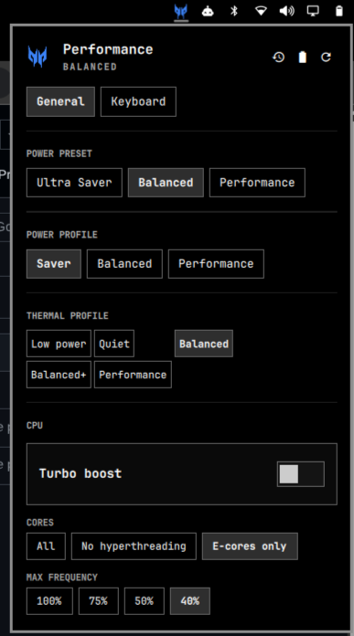
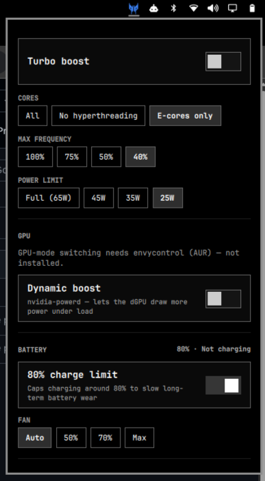
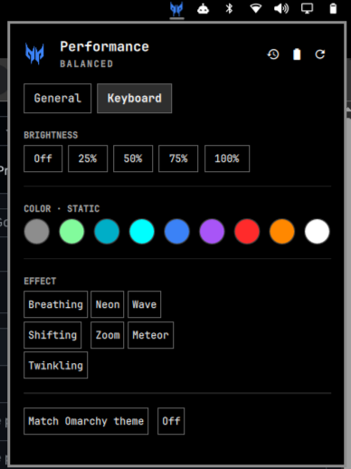

# PredatorSense — for Acer Predator laptops

An [Omarchy](https://omarchy.org/) `omarchy-shell` bar-widget plugin: a real power/CPU/GPU/
battery/keyboard control center in your bar, built for **Acer Predator** laptops (and useful,
minus the Acer-only bits, on any Intel `intel_pstate` + RAPL laptop). Part of the personal
[`omarchy-setup`](https://github.com/Rezwoan/omarchy-setup) dotfiles repo — not a published
marketplace plugin.

**Tested on: Acer Predator Helios Neo 16 (PHN16-71), Intel i5-13500HX, NVIDIA RTX 4050.**



> Independent, unofficial personal tooling — not affiliated with, endorsed by, or supported by
> Acer Inc. "Predator" and the Predator logo are trademarks of Acer Inc., used here only to
> identify the hardware this targets.

## Why

Windows has PredatorSense. Omarchy didn't have anything, so this ports the useful parts of it —
plus a few things PredatorSense doesn't even do (CPU core-count control, RAPL power-limit
presets) — into a proper bar widget that matches your theme.

## Install / enable

Lives at `~/.config/omarchy/plugins/io.github.rezwoan.performance/`, deployed by this repo's
`install.sh` (or copy the directory manually onto any Omarchy 4.0.1+ machine). The panel works
immediately in read-only mode (live status only). The first time you want to actually *change*
something, click **Enable privileged controls** in the panel — one real password prompt, ever
(see [How it works](#how-it-works)); every control after that is silent.

Open it from the bar icon, or press the physical **Predator button** (bound in
`~/.config/hypr/bindings.lua` via `code:156` — confirmed via raw evdev capture to fire evdev code
148 (KEY_PROG1) on the internal keyboard device, entirely distinct from Fn+F6, which fires on
different devices and never touches that code).

### Unlocking the Acer-only sections

Two optional AUR packages unlock more of the panel — everything else works without them:

| Package | Unlocks |
|---|---|
| `linuwu-sense-dkms` | Keyboard tab (RGB), 80% battery charge limit, fan speed |
| `envycontrol` | GPU mode switching (Integrated / Hybrid / Nvidia) |

If `linuwu-sense-dkms` is installed but the Keyboard tab still says it isn't detected, its
kernel module probably lost the race to the stock `acer_wmi` driver at boot — the panel detects
this and shows an **Enable keyboard RGB now** button that fixes it with one click and one
password prompt. No manual `modprobe`/blacklist editing.

## What it does

**General tab**
- One unified **Profile** selector — Ultra Saver / Saver / Balanced / Performance / Ultra
  Performance / Custom — each named preset bundling CPU cores, turbo, frequency cap, RAPL power
  limit, thermal profile, fan, keyboard color, and screen brightness. Persisted and silently
  reapplied on every boot. Custom isn't a real preset — it's a passive indicator that lights up
  whenever a raw control below (or in the Advanced popover) has been hand-tuned since the last
  named preset was applied.
- **Advanced** (small gear ⚙ button next to the GPU-stats/battery-info icons): the raw power
  profile (power-profiles-daemon) and thermal profile (every `platform_profile` your firmware
  exposes, not a hardcoded list) controls, for manual overrides outside the named presets.
- CPU: turbo boost, core mode (all / no hyperthreading / E-cores only), max frequency cap, RAPL
  package power limit
- GPU: mode switching (needs `envycontrol`, reboot required), Nvidia dynamic-boost toggle
- Battery: live percentage/status, 80% charge-limit toggle, fan speed
- Session: reopens your open windows + workspaces on next login



**Keyboard tab** (4-zone RGB)
- Brightness (5 steps)
- Static colors: theme accent, live Predator-mode color (green/magenta/blue, matching whatever
  the bar icon is currently tinted), plus 9 fixed swatches
- 7 animated effects (Breathing / Neon / Wave / Shifting / Zoom / Meteor / Twinkling)
- Quick actions: match Omarchy theme, match Predator mode

The bar icon is the Predator claw mark, recolored live to match your active mode — green for
battery saver, neon magenta for performance, blue for balanced, your theme's foreground color
otherwise.



## How it works

Every privileged write goes through one root-owned, verb-whitelisted script
(`/usr/local/bin/omarchy-perf-helper`) — it only accepts an exact, hardcoded set of
verbs/values (`turbo on|off`, `cpu-cores all|no-smt|ecore`, six-digit hex colors validated by
regex, etc.) and refuses everything else. It can't be redirected into running arbitrary
commands even though it runs as root.

Authorization is a **NOPASSWD sudoers rule scoped to that exact binary**
(`/etc/sudoers.d/omarchy-perf-helper`) — every control calls `sudo -n omarchy-perf-helper ...`,
which fails closed (no prompt, no hang) if the rule isn't installed yet. `setup.sh` (what the
"Enable privileged controls" button runs, via `pkexec` — the one real password prompt in the
whole plugin) installs the helper and this rule; nothing is installed until you click that
button.

## Uninstall

```bash
omarchy plugin remove io.github.rezwoan.performance
sudo rm -f /usr/local/bin/omarchy-perf-helper \
           /etc/sudoers.d/omarchy-perf-helper \
           /etc/systemd/system/omarchy-perf-restore.service
sudo systemctl daemon-reload
```
(The last three lines only apply if you'd clicked "Enable privileged controls" — skip them if
you never did.)

## Compatibility

| Feature | Requires |
|---|---|
| Bar icon, status, power presets, power profile | Any Omarchy 4.0.1+ install |
| Thermal profile, CPU turbo/cores/frequency, RAPL power limit | Intel CPU with `intel_pstate` + RAPL (most 8th-gen+ Intel laptops) |
| GPU mode switching, dynamic boost | NVIDIA Optimus laptop + `envycontrol` |
| Keyboard RGB, 80% battery limit, fan speed | Acer laptop + `linuwu-sense-dkms` |
| Physical Predator-button keybind | Acer laptop where the button reports evdev KEY_PROG1 (verify with a raw evdev capture — see `claude/memory/performance-plugin.md` in the parent repo) |

Not an Acer Predator? The General tab (minus GPU/battery-limit/fan) still works on any
Intel laptop. The Keyboard tab and those two General-tab rows will just stay hidden.

## License

[MIT](LICENSE)
